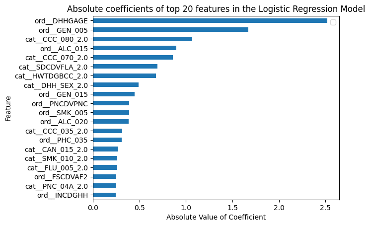
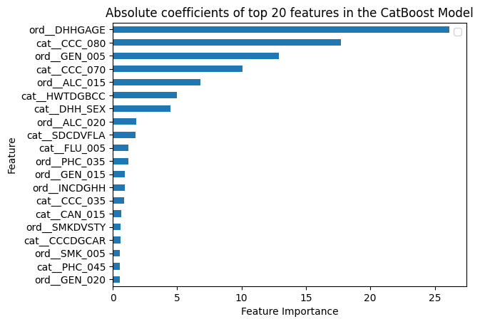

Note: This file is being edited.

# Diabetes Prediction using Canadian Community Health Survey Data

This project explores and builds a predictive model for identifying individuals at risk for diabetes, using data from the [**Canadian Community Health Survey (CCHS) Public Use Microdata File (PUMF)**](https://www150.statcan.gc.ca/n1/en/catalogue/82M0013X) for the years 2019-2020. The survey is broad and contains more than 600 questions on a variety of topics such as geographical location, demographics, general health, general mental health, education, chronic conditions (including diabetes), lifestyle factors such as fruit and vegetable consumption, smoking, alcohol use, drug use, physical activity, sedentary behaviours, sexual behaviours etc., engagement with healthcare system, screening test, involvement with community, socio-demographic characteristics such as country of birth, immigration status etc., health insurance, food security, household income and many more.

-   The project includes exploratory analysis to identify the best methods for data pre-processing, and implements machine learning methods such as Logistic Regression, SupportVectorClassifier and LightGBM to predict the presence of diabetes in survey respondents, and to identify the most important features asssociated with the prediction.

-   Feature selection and undersampling are used to balance the classes in the dataset.

-   Precision recall curves and F1 score are used to assess and compare different models.

-   The project shows that general purpose survey data can be used to recover important factors associated with chronic conditions such as diabetes, but the predictive models built on these data suffer from low precision when data are unbalanced (less positive cases compared to negative cases), i.e., a large number of false postives.

------------------------------------------------------------------------

## Content

1.  [Objective](#objectives)
2.  [Methodology](#methodology)
3.  [Results](#results)
4.  [Conclusions](#conclusions)
5.  [Working Notes](#working-notes)

## Objective

The main goal of this project is to understand the following:

**Can a general community health survey data be used to extract useful information about factors associated with a chronic condition such as diabetes?**

## Methodology {#methodology}

### Exploratory Data Analysis

#### Understand the variables present in the data

The data consist of 691 variables. All variables contained data encoded as numbers. It was important to use the data dictionary given along with the data to understand what the codes meant. These variables span categories such as location, demographics, work details, level of education, general health, general mental health, chronic disease, lifestyle factors such as exercise, diet, smoking, tobacco, cannabis, alcohol, drugs, access to primary health and other healthcare facilities, sense of connection to community and healthcare services, food security, income, health insurance etc.

We need some way to reduce these variables for the predictive model.

#### Filter the data to include only adults and people with known diabetes status.

As a first step, data were included for the adult population (age 18+) and for people whose diabetes status was known. This leaves a total of 99153 rows in the data.

#### Separate the data into training and test sets

At this stage, 30% of the data were kept aside as test set. I made sure to do a stratified split of the data to ensure that the ratio of diabetes to non-diabetes cases was the same in training data and test data. The training data consisted of a total of 69,407 rows, with 62,529 non-diabetes, and 6878 diabetes rows. The rest of the steps were performed with the training data.

### Intial feature selection

#### Calculate missing values for each variable and remove variables with \>30% missing data

A key observation was that missing data was encoded as numerical codes. The exact code used varied from feature to feature, but missing data categories were the same across the data. These categories were: 1. Valid skip 2. Don't know 3. Refusal 4. Not stated The codes used ranged from 6-9, 96-99, 996-999, 9996-9999, 999.6 to 999.9 etc. I wrote a function to identify the missing codes in each column and convert them to na values. Then the percentage of data missing for each feature was calculcated and the features with more than 30% missing data were excluded.

#### Remove variables that have same value across all rows and that have different values across all rows, as well as variables that do not contain any useful information.

#### Identify ordinal and categorical variables, calculate correlation between all variables and drop highly correlated variables.

Out of the remaining variables, I plotted each of them to identify which ones were ordinal, i.e., where numeric codes had an order and which were nominal/categorical, i.e., the numeric codes did not have an order. For example, sex is a nominal column and houshold income is an ordinal column.

#### Undersample the data to balance classes.

The training data had \~6900 diabetes cases and a much higher number of non-diabetes cases. Therefore, I undersampled the non-diabetes cases to balance the classes and get a total of \~13400 training samples.

### Data Pre-processing

#### Pre-process the categorical and ordinal columns

1.  Ordinal columns: For ordinal columns, I convert the missing data numeric codes to na values, impute the missing data using most-frequent value, and scale the data using min-max scaler.

2.  For nominal/categorical columns, I convert the missing data numeric codes to na values, impute the missing data using most-frequent value and use one-hot encoding.

### Build a predictive model

I tried four different models on the data:

1.  Logistic Regression
2.  RandomForest
3.  Support Vector Classifier
4.  CatBoost

### Evaluate the model fit and its performance.

I evaluated the models using cross-validation. In particular, for each of the models, the following were examined: 1. The learning curves on training set and validation set. these were used to evaluate if the model was overfitting the data or not. 2. Confusion matrix to identify false positives and false negatives 3. Precision recall curve

#### Identify the most important features contributing to prediction of diabetes status.

For each of the models that were not overfitting the data, the top 20 features were compared.

## Results {#results}

### Number of features remaining after data-cleaning

We removed features with the following characteristics: 1. more than 30% data missing 2. with same value in all rows 3. used as flag or as numbers 4. with high correlation with other features

After the above steps, 53 features out of the original 691 remained in the data and were used for subsequent analysis.

### Understanding the performance limit of a predicitve model on survey data

After initial feature selection and pre-processing, all remaining features are discrete. Therefore, by selecting a couple of features, we can actually calculate the expected performance limit of a predictive model built on the data. I selected two columns - age and taking medication for high blood pressure - and looked at the diabetes status for each combination of these two features. A key observation here was that for the full data, with larger number of non-diabetes patients, it was not possible to manually select which group should be assigned True or False. However, for the balanced data, we could assign diabetes status as True or False based on which class had more number of patients.

Therefore, all subsequent analysis was done on balanced data, with equal number of diabetes and non-diabetes patients. The undersampled data consisted of 6878 diabetes cases and 6878 non-diabetes cases.

If we assigned a prediction of True or False to each group based on the most common class in that group, I was able to calculate the true positive, true negative, false positive and false negative numbers, and therefore, precision, recall and F1 score for the balanced training data. These numbers gave the upper performance limit of a model using age, and blood pressure medication as the two features.

This calculation also gave a performance metric to compare any predictive model that we build.

The scores for precision, recall and F1 with two features - age and diabetes medication on balanced training data were 0.73, 0.72, and 0.72 respectively.

If the same model were used to make predictions on the original unbalanced data, the precision, recall and F1 score became 0.23, 0.72, and 0.35, respectively.

### Logistic Regression model

Baseline logistic regression model, without any finetuning, does not overfit the data and achieves the maximum performance expected on the data.

#### Learning curve

#### Performance metrics

The average precision, recall and f1 score of the logistic regression model are as follows:

| Score metric | Value |
|--------------|-------|
| Precision    | 0.76  |
| Recall       | 0.81  |
| F1           | 0.79  |

#### Top 20 features

### Random Forest Model

Random Forest model is overfitting the data even after hyperparameter tuning. Therefore, I am not using Random Forest for further analysis

#### Learning Curve

### Support Vector Classifier

With the default parameters, SVC is overfitting the data, but the curves are improving with more training data. However, SVC was too slow and I am not using it for further analysis.

#### Learning Curve

### CatBoost

CatBoost required slight finetuning of the learning rate to prevent overfitting. The final learning rate used was 0.005

#### Learning curve

#### Performance metrics

The average precision, recall and f1 score of the logistic regression model are as follows:

| Score metric | Value |
|--------------|-------|
| Precision    | 0.75  |
| Recall       | 0.85  |
| F1           | 0.80  |

#### Top 20 features

### Most important features associated with diabetes

The 8 features that are common in top 10 features from both Logistic Regression and CatBoost are:
1. DHHGAGE - Age
2. CCC_080 - Took medication for high blood cholestrol/lipids in the last one month
3. GEN_005 - Perceived Health - Excellent, very good, good, fair, poor
4. CCC_070 - Took medication for high blood pressure in the last one month
5. ALC_015 - Frequency of drinking alcohol in the last 12 months
6. HWTDGBCC - BMI classification - underweight or overweight/obese
7. DHH_SEX - Sex at birth
8. SDCDVFLA - Are you a visible minority

- Age is the most important feature in both models. The top 5 features are also common in both models, though the order of importance differs slightly.

## Conclusions {#conclusions}

Predictive machine learning is a powerful tool to extract useful associations between features from surveys, even when data are collected for generic purposes. For example, community health survey data gathers diabetes status as only one of the features, but we were able to recover known lifestyle and health factors associated with diabetes from these data in an unbiased manner.

The predictive models themselves may not be very useful because there is an upper limit to the predictive power because of the fact that all features the remained in the data after pre-processing are discrete. It is also known that features such as blood sugar level are highly predictive of diabetes status, but are absent from the community health survey data.

## Working Notes {#working-notes}

2025/05/25

2025/05/21

-   I calculate the maximum precision, recall and f1 score that can be obtained in the data manually. I was able to do this because my data consist of discrete value columns and it is possible to manually classify them. I picked two columns and calculated the theoretical maximum.
-   I then resampled the data and fit a logistic regression model with limited features
-   To my surprise, I discovered that the f1 score was close to theoretical maximum if the classes were balanced.
-   I am not sure how to calculate a theoretical maximum if classes are not balanced.
-   I discovered that when I tried undersampling yesterday, I used it in a pipeline from the package `imblearn` and that was not working. If I resampled data separately and then built a logistic regression model on resampled, balanced data, I was able to achieve the theoretical maximum.
-   I have added a notebook with the finalized steps.
-   I have also put the data cleaning functions in the src folder and imported those functions in the notebook to use.

2025/05/20

-   I plotted learning curves for three types of models - linear Logistic Regression, RandomForest, gradient boosting (lightGBM).
    -   lightGBM and logistic regression are underfitting, and their validation errors are plateauing very early (with 10000 data points, instead of 69000 that are in the training set.)
    -   random forest is overfitting the data a lot, so not using it going forward.
-   I looked at highly correlated features and removed them. I also tried recursive feature elimination and that showed that a maximum of 10 features is good enough to reach max performance in logistic regression.
-   I also tried to use selectKBest features and that also does not improve the model much with increasing number of features.
-   
    -   Selected a small number of features - 3 - to examine the errors in the model in detail. Even with three features, the f1 score for logistic regression and lightGBM is 0.36.
-   I performed error analysis on this model and found that for lightGBM, the performance of the model is maximized. because the features are all categorical, the model has to choose combinations of features to make a prediction. As long as the model is choosing the combination that maximizes precision and recall, it works and lightGBM seems to be doing that.
-   I also tried balancing the dataset with RandomUnderSampling and that also does not make any difference in the performance.
-   Because all features are categorical, there is a limit to max performance, which is clear using a small number of variables.
-   I don't think combining models would do much in this case.
-   I think I will also check a few other models like kNN classifier (kNN would not be good here because) and SVC, and perhaps try a dimensional reduction method, do error analysis on those with the 3 feature dataset and finalize the model. - TO DO

2025/05/17 - So far the performance of linear models (Logistic Regression) is similar to more complex models (RandomForest and XGBoost) - Fine-tuning the models: - Tried XGBoost, RandomForest, LogisticRegression - the performance of RandomForest improved with finetuning, reaching an f1 score of 0.42 - Better data pre-processing - Treat ordinal features as categorical - no change - Remove features that have low variance - no features with low variance - Remove features that are highly correlated - TO DO - Looked at what measures of correlation to use for ordinal and categorical/nominal data. - Peform automated feature selection - TO DO - Error Analysis - TO DO - Look at learning curves on training and validation data - TO DO - Try combining models to improve performance - TO DO

2025/05/11-16

-   Examined data distributions, correlations, and potential predictors
-   Looked at prevalence of diabetes across provinces, by age group, by sex, by household income.
-   Identified important variables
-   Handled missing values
-   Developed a baseline model
    -   One-hot encoding of categorical variables
    -   Standardization or normalization where applicable
    -   Boolean outcome variable for diabetes diagnosis
    -   Evaluation metrics: F1 score, precision, recall
    -   Handling class imbalance
    -   Tried Logistic Regression, SVC and RandomForest